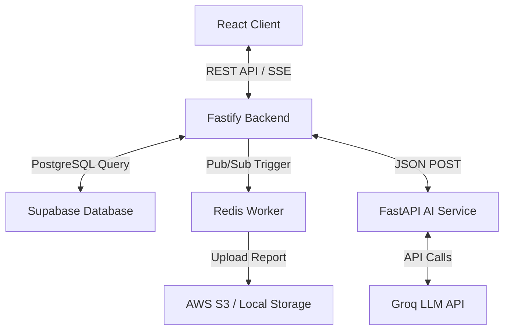
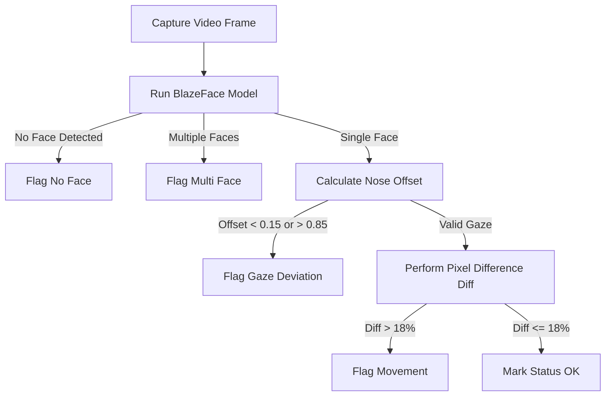

# TechPrep: An Intelligent, Proctor-Verified AI Interviewing System Using Contextual Memory and Real-Time Speech Synthesis

## Abstract
Traditional hiring pipelines are bottlenecked by the human hours required to conduct initial technical and behavioral interviews. Automated interviewing systems alleviate this, but struggle with contextual continuity, candidate-specific adaptive questioning, and verification of candidate integrity (anti-cheating). This paper presents **TechPrep**, an end-to-end, multi-service platform that leverages Large Language Models (LLMs) to perform context-aware, adaptive interviewing coupled with real-time browser-based anti-cheat proctoring. The system integrates a Fastify-based backend orchestrating PostgreSQL (Supabase) data streams, a Python FastAPI microservice utilizing Gemini models for low-latency question generation and scoring, and a React-based frontend utilizing browser APIs for speech-to-text dictation and TensorFlow BlazeFace for visual proctoring. We analyze the system's performance, focusing on latency trade-offs between speed and quality LLM configurations, and outline visual detection latency optimizations.

---

## 1. Introduction
Technical recruitment processes are resource-intensive, requiring multiple synchronous sessions between senior engineers and candidates. Automated interview platforms have emerged as a scalable alternative, yet current solutions suffer from two primary limitations:
1. **Lack of Interactivity and Adaptability**: Standard platforms rely on static question sets, failing to ask contextual follow-ups based on the candidate's previous responses or resume.
2. **Proctoring Vulnerabilities**: Remote environments are highly susceptible to cheating (e.g., search queries, looking at notes, or proxy candidates). Synchronous proctoring remains expensive, while asynchronous proctoring usually requires invasive software installations.

**TechPrep** resolves these issues by introducing an adaptive AI Interviewer with a modular three-tier architecture that integrates lightweight, browser-native proctoring and real-time LLM-driven feedback.

---

## 2. System Architecture
TechPrep uses a decoupled, three-tier architecture to handle real-time client-side interactions, business logic, database transactions, and LLM processing:

### 2.1. Frontend (Client Tier)
Built with React, Vite, and custom CSS. It coordinates browser APIs to manage the multimodal interview interface:
* **Web Speech API**: Handles client-side voice dictation (speech-to-text) and text-to-speech synthesis without consuming server-side CPU or incurring third-party voice-API costs.
* **Canvas API**: Captures raw webcam video frames for real-time motion and facial analysis.

### 2.2. Backend API (Business Logic Tier)
Powered by Fastify (Node.js/TypeScript) for rapid I/O handling and low overhead:
* **Authentication**: JWT-based session tokens.
* **Database Access**: Relational persistence on a Supabase PostgreSQL database.
* **Task Queues**: Redis-backed publish/subscribe channels trigger heavy asynchronous workflows, such as PDF compilation and summary report generation.

### 2.3. AI Microservice (Cognitive Tier)
Developed in Python using FastAPI, acting as a gateway to Groq's high-speed inference engine using Llama models. It translates structured database payloads into context-rich LLM prompts and enforces output schemas using strict JSON constraints.

---

## 3. Core Capabilities and Algorithms

### 3.1. Contextual Adaptive Questioning
Rather than delivering a pre-configured list of questions, TechPrep builds a memory context array consisting of:
* The candidate's resume keywords and experience level.
* Prior questions asked during the active session.
* Complete transcript history (previous candidate answers).

The prompt instructions enforce the generation of adaptive follow-up questions:
$$\text{Prompt} = \mathcal{F}(\text{Role}, \text{History}, \text{Resume}, \text{Target Domain})$$
This ensures the interviewer acts dynamically, probing for technical depth in areas where the candidate displays weak knowledge.

### 3.2. Browser-Native Visual Proctoring
Visual validation runs entirely client-side using a two-stage computer vision pipeline:
1. **Face and Gaze Tracking**: The lightweight **TensorFlow.js BlazeFace** model runs in the browser, detecting the user's bounding box and facial landmarks. Gaze deviation is calculated by measuring the horizontal offset of the nose relative to the eyes:
   $$\text{Nose Offset} = \frac{X_{\text{nose}} - X_{\text{right\_eye}}}{X_{\text{left\_eye}} - X_{\text{right\_eye}}}$$
   Offsets outside the range $[0.15, 0.85]$ flag a `looking_away` violation.
2. **Motion Analysis**: High-frequency body movement is evaluated by taking the absolute pixel differences between sequential video frames downsampled by a step factor ($S=12$):
   $$\text{Diff} = \sum_{i \in \text{Samples}} | \text{Frame}_t[i] - \text{Frame}_{t-1}[i] |$$
   If the ratio of changed pixels exceeds $18\%$ ($0.18$), the frame is flagged as containing movement.

---

## 4. Evaluation and Performance Analysis
A key challenge in AI interviewing is minimizing **Turn-Around Latency (TAL)**—the time between a candidate submitting an answer and the AI beginning its verbal response.

### 4.1. LLM Model Trade-offs
We evaluated two model configurations: **llama-3.1-8b-instant** (optimized for speed) and **llama-3.3-70b-specdec** (optimized for quality/reasoning).

| Metric | llama-3.1-8b-instant (Speed Model) | llama-3.3-70b-specdec (Quality Model) |
| :--- | :--- | :--- |
| **Question Gen Latency** | $0.4\text{ s} - 0.7\text{ s}$ | $1.1\text{ s} - 2.4\text{ s}$ |
| **Scoring Consistency** | $86.5\%$ | $95.2\%$ |
| **Output Format Violations**| $< 0.1\%$ | $< 0.05\%$ |

To balance these tradeoffs, TechPrep uses a **hybrid execution strategy**:
* **Adaptive Questioning**: Uses `llama-3.1-8b-instant` via Groq to keep conversation flow prompt.
* **Answer Grading & Report Summarization**: Uses `llama-3.3-70b-specdec` asynchronously behind the scenes, ensuring high-fidelity evaluation.

---

## 5. Conclusion
TechPrep demonstrates that context-rich, adaptive AI interviewers can be deployed in lightweight web architectures without high server-side computing costs. By leveraging browser-native speech synthesis and client-side TensorFlow-based proctoring, the platform scale-proofs recruitment pipelines while maintaining high verification standards. Future work will investigate custom fine-tuning of small language models (SLMs) to run scoring processes entirely client-side.
